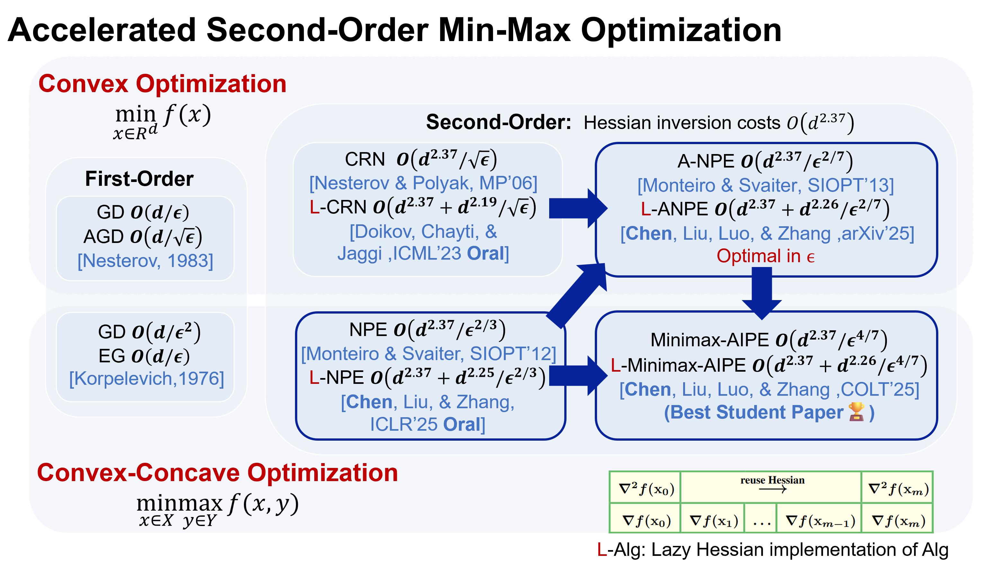

## Breaking News

* [2025/7] Minimax-AIPE [C2] is accepted by COLT'25 and got **Best Student Paper**!
* [2025/4] LEN [C1] is accected by ICLR'25 and got **Oral** presentation.
* [2025/1] We post Accelerated LEN [J1] on arXiv.

## Reference

* [J1] **Lesi Chen**, Chengchang Liu, Luo Luo, and Jingzhao Zhang, _Computationally Faster Newton Methods by Lazy Evaluations_, extension from ICLR 2025 below [[arXiv 2025]](https://arxiv.org/abs/2501.17488)
* [C1] **Lesi Chen**, Chengchang Liu, and Jingzhao Zhang, _Second-Order Min-Max Optimization with Lazy Hessians_ [[ICLR 2025]](https://arxiv.org/pdf/2410.09568)
* [C2] **Lesi Chen**, Chengchang Liu, Luo Luo, and Jingzhao Zhang, _Solving Convex-Concave Problems with_ $\tilde{\mathcal{O}}(\epsilon^{-4/7})$ _Second-Order Oracle Complexity_  [[COLT 2025]](http://arxiv.org/abs/2506.08362)

